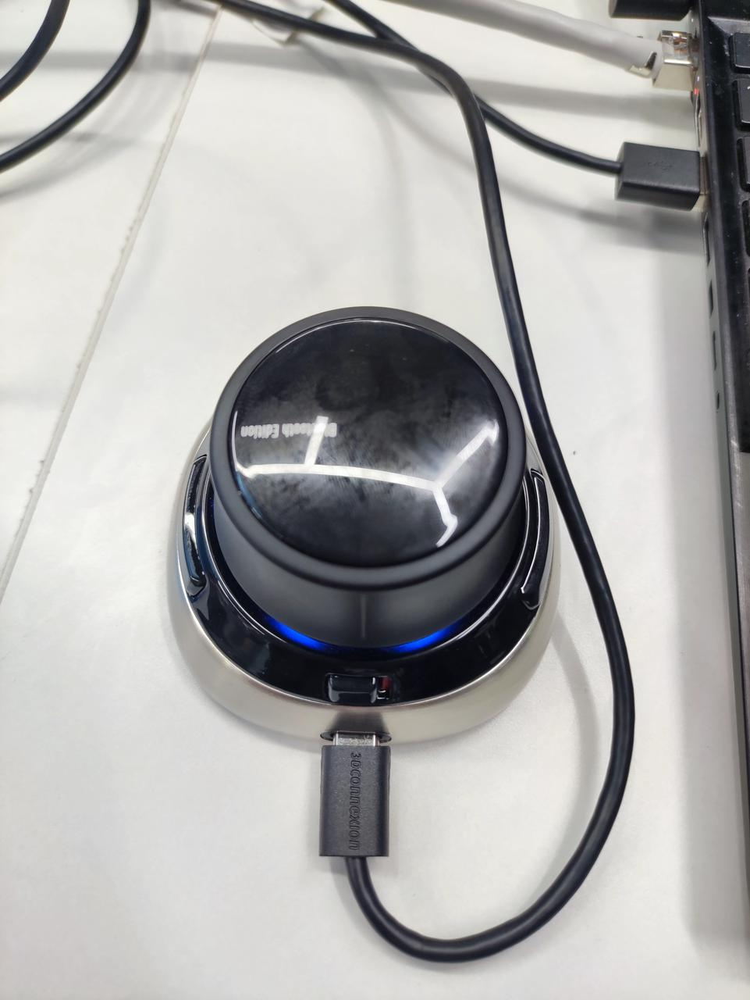

# Teleoperation
We use SpaceMouse to teleop the franka arm. (credit to https://github.com/columbia-ai-robotics/diffusion_policy)

## 1. Set Up
### 1. Install dependencies. 
```
sudo apt install libspnav-dev spacenavd
sudo systemctl start spacenavd
pip install https://github.com/cheng-chi/spnav/archive/c1c938ebe3cc542db4685e0d13850ff1abfdb943.tar.gz
```
if you cannot download this file, you can directly git clone this code, which inlcudes this file.
### 2. Reboot.
```
sudo reboot
```
### 3. Connect spacemouse via USB.


## 2. start control
### Method 1 directly start script (recommend)
```
./teleop/teleoperation.sh
```
### Method 2 start step by step
#### 1. start frankapy control

see more details in `Frankapy`

#### 2. start spacemouse driver 
```
cd teleoperation/franka
python teleop/spacemouse.py
```
Play with the device and you should be able to see realtime signal captured by the spacemouse.

#### 3. start teleoperation
```
cd teleoperation/franka
python teleop/run.py
```
#### orientation control
按住右边按键，操作摇杆即为控制姿态
#### position control
松开右边按键，操作摇杆即为控制位置

## 3. record trajectory
根据这个代码，完成通过3D鼠标遥操作机械臂，并记录机械臂的运动轨迹，而后进行重复运动
```
cd ~/Franka/frankapy
python teleop/record_trajectory.py
```
默认记录`10s`轨迹数据，数据存储在frankapy下

更改时间：
```
python teleop/record_trajectory.py -t 70 -o 
```
`-o`: 是否打开夹爪

`-f`: 默认输出pkl文件名
## 4. play record trajectory
```
python teleop/run_recorded_trajectory.py -t franka_traj.pkl
```

## 5. 如果突然卡住使用libfranka库复原

注意这里使用时要退出python的控制程序
机器人回到home state
```
cd ~/Franka/libfranka/build/examples
./communication_test 192.168.1.10
```